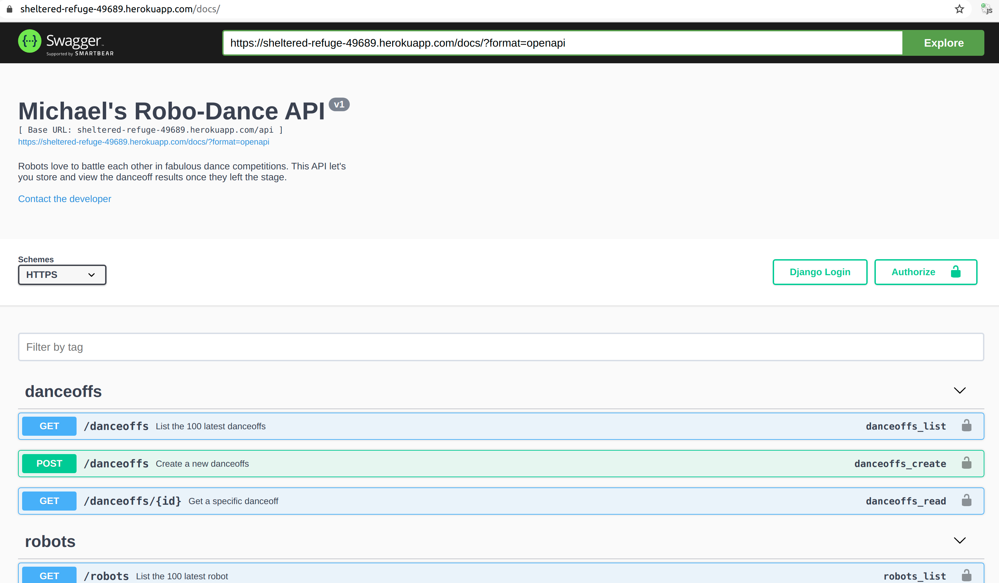
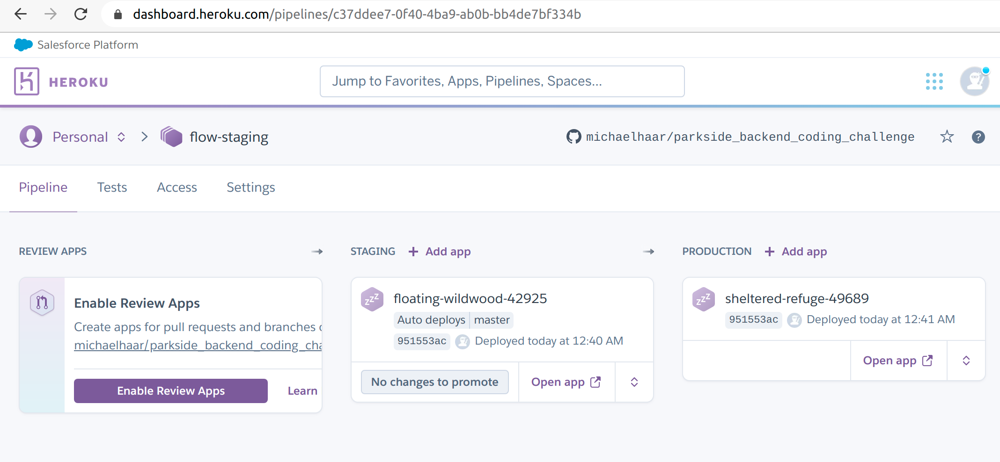
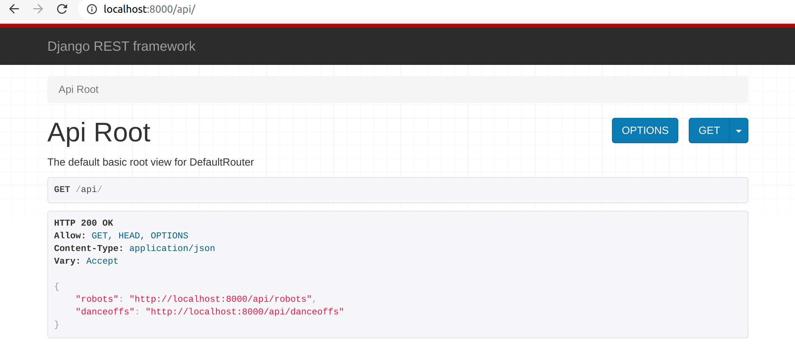

# Parkside Robo-Dance Coding Challenge (Backend) 🤖

## Live Demo

- API: https://floating-wildwood-42925.herokuapp.com/api/
- Documentation: https://floating-wildwood-42925.herokuapp.com/docs/

  
_Image Source: https://giphy.com/gifs/uofcalifornia-dancing-robot-robots-3o72F2gJOMNCsKobtK_

## Introduction

This repository was part of my job application process at [Parkside](https://www.parkside-interactive.com/) and contains a simple REST API that shows my current skills and talent as well as my preferred work style. I was asked to built the backend for a **Robo-Dance** competition app.

## Overview 🧑‍💻

Robots love dancing and regularly battle each other in fabulous dance competitions. Goal of the project was to design a API for a Robo-Dance competition app in a way that a frontend application could consume it. Therefore I created two API endpoints with the following features:

- **/robots**

  - add a robot
  - receive a individual robot
  - receive all robots
  - (data is stored in a persisted data source)

- **/danceoffs**
  - store a danceoff result
  - store multiple danceoff results with a single request
  - receive all danceoffs
  - receive a specific danceoff

Please checkout the [official project description from Parkside](docs/Parkside_Coding_Challenge_Backend.pdf) for more information.

## My Solution

### Honor Code

> I did not cheat or plagiarize the work of others during the whole project. If I used work (e.g. copying code) from others, I gave proper attribution to the author/source.

### Version Control

- I used [git](https://git-scm.com/) and [Github](https://github.com/) as version control system.
- I followed the `Git-Flow` design pattern
  - branches: feature branches, develop, release, master
  - I used `Github issues` to track all the required features of this project and added their IDs to the feature branch name
- I tried to follow the [Udacity Git Commit Message Style Guide](http://udacity.github.io/git-styleguide/)

  
_Git-Flow example (source: https://nvie.com/posts/a-successful-git-branching-model/ )_

### Project Architecture 📂

I decided to use [Django](https://www.djangoproject.com/) and [Django REST Framework](https://www.django-rest-framework.org/) for this project (mainly because already I used these frameworks in some other projects).

This leads to the following folder structure:

```
parkside_backend_coding_challenge	// project root dir
|
|- README.md					// main doc file
|- requirements.txt				// contains python dependencies
|- Procfile						// Heroku file
|- runtime.txt					// Heroku runtime file
|- /.vscode						// settings for my texteditor
|- /.github						// github workflow files
|- /.git						// used by git
|- /docs						// my doc folder
`- /django_webserver			// the Django Project
   |- manage.py					// Django’s main file
   |- .gitignore				// excludes files from git
   |- /config					// Django root dir
   |  |- urls.py				// defines the url routing
   |  |- /settings				// Django settings for dev/prod
   `- /robodanceapi				// Django app for the API
      |- models.py				// defines database objects
	  |- test.py				// contains the unit tests
	  |- urls.py				// defines the url routing
	  |- views.py				// request -> response
	  |- serializers.py			// convert input to db model
```

### Unit Tests and Continuous Testing

I wrote some test cases in order to validate, that my API works as expected.

You can run the test cases with the following command:

```bash
# setup dev environment first! (see Usage section)

# run all unit tests
python django_webserver/manage.py test
```

> Note: I've also set up a [Github Workflow](https://docs.github.com/en/actions/reference/workflow-syntax-for-github-actions) to run the unit tests automatically if a new commit is made to the `master` or the `develop` branch. This is done by adding the `.github/workflows/django.yml` file and is called [Continuous Testing](https://en.wikipedia.org/wiki/Continuous_testing).

### API Documentation 📖

I used [drf-yasg](https://github.com/axnsan12/drf-yasg) to generate a Swagger/OpenAPI 2.0 documentation. It exposes 3 documentation endpoints:

- A JSON view of our API specification at `/docs.json`
- A YAML view of our API specification at `/docs.yaml`
- A swagger-ui view of your API specification at `/docs/`

  
_API documentation preview_

### Continuous Delivery and Hosting 🚀

The web app is hosted on Heroku and will automatically deploy the new app if you make a new commit to the master branch. This is called [Continuous Delivery](https://en.wikipedia.org/wiki/Continuous_delivery)

The following endpoints might be interesting:

- Documentation:  
  https://floating-wildwood-42925.herokuapp.com/docs/
- API:  
  https://floating-wildwood-42925.herokuapp.com/api/



To implement this feature I followed the [From Project to Productionized with Python](https://blog.heroku.com/from-project-to-productionized-python) tutorial from the official Heroku website.

> Note: I ran into some issues:
>
> 1. `runtime.txt` wasn't working.  
>    I had to use `python-3.8.7` instead of `python-3.8.2`, which was used in the tutorial (see: [Supported runtimes](https://devcenter.heroku.com/articles/python-support#supported-runtimes))
> 2. Wrong `BASE_DIR` after doing the `Modularize your settings` step.  
>    I updated the `BASE_DIR` from `Path(__file__).resolve().parent.parent` to `Path(__file__).resolve().parent.parent.parent`
> 3. collection of static files wasn't working.  
>    I had to add `STATIC_ROOT = BASE_DIR.joinpath('staticfiles')` to the settings base file (see: [Django and Static Assets](https://devcenter.heroku.com/articles/django-assets))

## Usage (Dev Setup Guide)

We can set up our local development environment on Ubuntu with the following commands:

```bash
# clone the repo from github
git clone https://github.com/michaelhaar/parkside_backend_coding_challenge.git

# install the python dependencies
python -m pip install --upgrade pip
sudo apt install libpq-dev python3-dev #needed for psycopg2
cd parkside_backend_coding_challenge/
pip install -r requirements.txt

# Init the database
python django_webserver/manage.py migrate
```

Next we can start our dev server by typing:

```bash
# start the local development server
python django_webserver/manage.py runserver
```

Now we can open http://localhost:8000/api/ in our Web browser. We should see something like this:



## Outlook 📈

### What I would do better if I have more time?

- discuss project requirements in more detail
- add authorization and protect _create_ endpoints
- add further validation for the danceoff _bulk_create_ endpoint and add more unit tests
- provide a leaderboard feature

### How would I set up the frontend app?

First, I would try to define the requirements, which would probably give me something like this:

- the user should be able to start a new competition.
  - 10 distinct robots will be picked randomly
  - robots will be split into two teams
- the user should be able to start the competition.
  - each robot battles one robot from the opponent team
  - randomly choose a winner
  - send results to the backend using the API

Next, I would plan the architecture and the frameworks for the frontend. It would probably look like this:

- inside the django project, create a new django app called `frontend`
  - setup everything (urls, templates, static files, etc. )
- use [React](https://reactjs.org/) (maybe also [Redux](https://redux.js.org/), [React Router](https://reactrouter.com/) and [Bootstrap](https://getbootstrap.com/)) to build the frontend application
  - use [Axios](https://github.com/axios/axios) to make API calls
  - use [webpack](https://webpack.js.org/) to compile the Javascript code
- use Github `issues`, Git-Flow and feature branches to track the progress and organize my tasks
- some UI/UX mockups might be helpful
  - create the first drafts by hand and then use [Figma](https://www.figma.com/) for more details

## Used Frameworks, Libraries and APIs

- **[Django](https://www.djangoproject.com/)**: web framework for perfectionists with deadlines.
- **[Django REST Framework](https://www.django-rest-framework.org/)**: powerful and flexible toolkit for building Web APIs.
- **[drf-yasg](https://github.com/axnsan12/drf-yasg)**: generate OpenAPI 2.0 documentation
- for production/hosting:
  - **[gunicorn](https://gunicorn.org/)**: Python WSGI HTTP Server for UNIX
  - **[psycopg2](https://www.psycopg.org)**: most popular PostgreSQL adapter for the Python
  - **[django-environ](https://django-environ.readthedocs.io/en/latest/)**: utilize 12factor inspired environment variables
  - **[whitenoise](http://whitenoise.evans.io/en/stable/)**: simplifies static file serving for Python web apps
  - **[Heroku](https://www.heroku.com/)**: platform as a service

## Author

👤 **Michael Haar**

- LinkedIn: [@michaelhaar](https://www.linkedin.com/in/michaelhaar/)
- Github: [@michaelhaar](https://github.com/michaelhaar)
- Email: michael.haar@gmx.at
